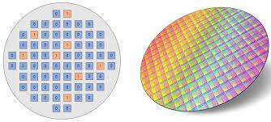
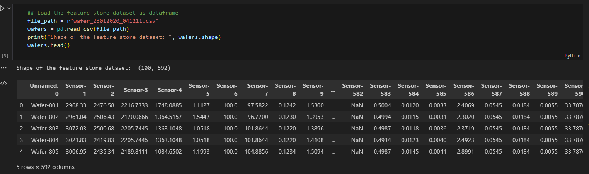
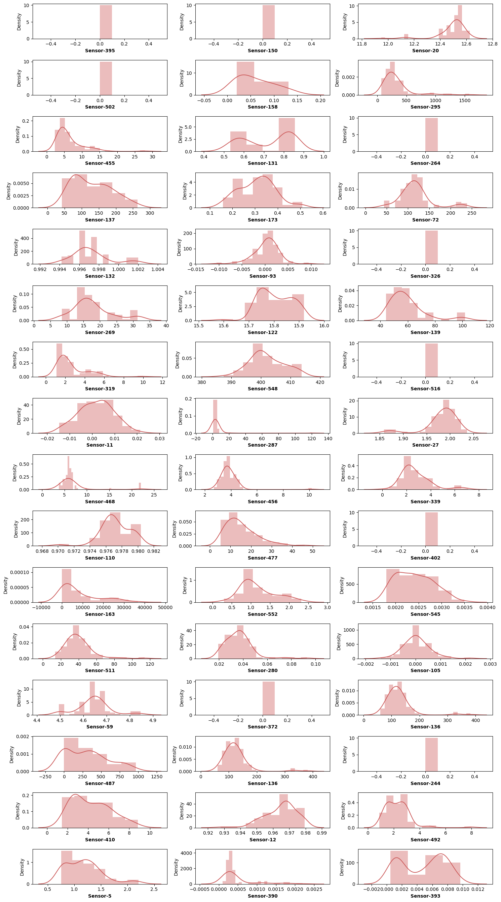
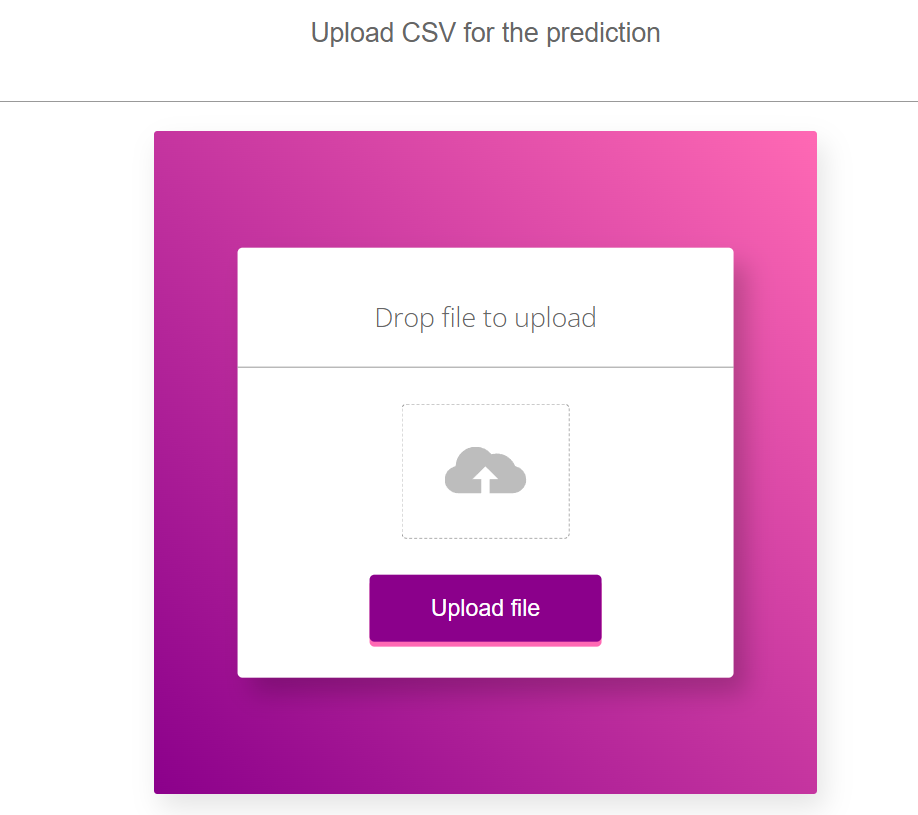

# 📄✏ Sensor Fault Detection Project

**Brief:** In the field of electronics, a __wafer__, also known as a slice or substrate, plays a vital role in the production of integrated circuits and solar cells. Essentially, a wafer is a thin slice of semiconductor material, typically crystalline silicon (c-Si), that serves as the foundation for constructing various microelectronic devices.

The wafer undergoes a series of intricate microfabrication processes, including doping, ion implantation, etching, thin-film deposition, and photolithographic patterning. These processes are essential for creating the desired circuitry and components on the wafer's surface. Each wafer houses multiple microcircuits, which are later separated through wafer dicing and then packaged as individual integrated circuits. <br>

<br>

The attached image visually represents the journey of a wafer through these manufacturing stages. It showcases the complexity and precision involved in transforming a wafer into functional microelectronic devices.

## Problem Statement

**Data:** Wafers data

**Problem Statement:** Wafers are predominantly used to manufacture solar cells and are located at remote locations in bulk and they themselves consist of few hundreds of sensors. Wafers are fundamental of photovoltaic power generation, and production thereof requires high technology. Photovoltaic power generation system converts sunlight energy directly to electrical energy.

The motto behind figuring out the faulty wafers is to obliterate the need of having manual man-power doing the same. And make no mistake when we're saying this, even when they suspect a certain wafer to be faulty, they had to open the wafer from the scratch and deal with the issue, and by doing so all the wafers in the vicinity had to be stopped disrupting the whole process and stuff anf this is when that certain wafer was indeed faulty, however, when their suspicion came outta be false negative, then we can only imagine the waste of time, man-power and ofcourse, cost incurred.

**Solution:** Data fetched by wafers is to be passed through the machine learning pipeline and it is to be determined whether the wafer at hand is faulty or not apparently obliterating the need and thus cost of hiring manual labour.

#### Dataset is taken from Kaggle and stored in mongodb

🔧 Built with
- flask
- Python 3.8
- Machine learning
- Scikit learn
- 🏦 Industrial Use Cases

<br>

### Setting up Project Environment :

This project is a separate project using Conda of Anaconda. It provides a clear structure for organizing your code and dependencies using a virtual environment. The project includes the following folders and files:

- artifacts/: This folder is used to store any generated artifacts, such as trained models or processed datasets.
- logs/: This folder is used to store log files generated by the application.
- Notebooks/: This folder is used to store Jupyter notebooks for data exploration or experimentation.
- src/: This folder contains the source code of your project.
- templates/: This folder is used to store HTML templates for your Flask application.
- environment/: This folder is used to store the virtual environment created by Conda.
- .gitignore: This file specifies which files and folders should be ignored by Git.
- application.py: This is the main Flask application file.
- setup.py: This file contains the configuration for packaging your project as a Python package.
- upload_data.py: This file is used to send data to your mongodb Database
- prediction_artifacts: This file used to upload the test data giving by user to our Flask file
- predictions: This file contain the return result of test file given by user in Fask file and it tell row-by-row prediction into __Good : Bad__ 

#### Getting Started

To set up the project, please follow the instructions below:

##### Prerequisites

- Anaconda or Miniconda should be installed on your system.
- Installation
- Clone the project repository:
```
git clone <repository_url>
cd <project_directory>
```

- Create a new Conda environment for the project:
```
conda create --name <env_name> python=3.9
```
- Activate the newly created environment:
```
conda activate <env_name>
```
- Install the project dependencies:

```
pip install -r requirements.txt
```
- Running the Application

Make sure you are in the project directory and the Conda environment is activated.

#### Start the Flask application:

```
'python application.py' 

```
Open a web browser and visit http://localhost:5000 to access the application.

#### Additional Notes

- Having a separate project environment, such as the one created with Conda, offers several advantages:

- Dependency Isolation: By creating a virtual environment, you can install project-specific dependencies without interfering with the system-wide Python installation or other projects on your machine.

- Reproducibility: The project environment ensures that all project contributors are using the same set of dependencies, making it easier to reproduce and share the project's results.

- Version Control: By including the virtual environment in your project repository, you can easily recreate the same environment on different machines or after a fresh clone of the repository.

- Package Management: Using setup.py allows you to define the project's dependencies and make it easier to package and distribute your project as a Python package.

- By following these instructions and organizing your project with a separate environment, you can maintain a clean and reproducible development environment while keeping your project dependencies isolated and well-managed.

<br>

## EDA & Business Implication

EDA stands for exploratory data analysis where we explore our data and grab insights from it. EDA helps us in getting knowledge in form of various plots and diagrams where we can easily understand the data and its features.

### Observation

As you see our Dataset include 592 columns.For each Waffer we get values from 500+ sensors and based on that we tell whether the waffer is functioning(+1) or faulty(-1). <br>

<br>

__Note__: It is good practice to split the dataset into train and test due to reason of data leakage : __Data leakage refers to a situation where information from the testing set unintentionally influences the model development process, leading to overly optimistic performance estimates. It can occur when steps such as feature engineering, feature selection, or exploratory data analysis (EDA) are performed using information from both the training and testing data before the model is trained.__

```
## Train-Test Split

from sklearn.model_selection import train_test_split

wafers, wafers_test = train_test_split(wafers, test_size=.20, random_state=42)
```

- As there is no Categorical features in our Dataset , So Numerical Univariate Analysis is : <br>
<br>


### Insight:

<br>

Pretty good amount of them (either first 50 or random 50) either are constant (have 0 standard deviation) or have left skewness and right skewness. It ain't possible to analyze each feature and deal with its outliers individually, thus we oughta depend upon the scaling. 

For the **features with 0 standard deviation**, we can straight away drop them and for others that do have outliers, we gotta go ahead with the `Robust Scaling`.

## Model Training with Feature Selection, Feature Engineering, and Outlier Detection

In this project, we aim to predict the price of a given dataset using machine learning models. Before training the models, we perform the following steps:

- Data Splitting: We split the dataset into training and testing sets. The training set is used to train the models, while the testing set is used to evaluate their performance.

- Feature Selection: We apply feature selection techniques to identify the most relevant features for our prediction task. This helps in reducing the dimensionality of the dataset and improving the model's performance.

- Feature Engineering: We perform feature engineering to transform the existing features or create new features that can provide more meaningful information to the models. This step aims to enhance the predictive power of the features.

- Outlier Detection: We detect and handle outliers in the dataset. Outliers can significantly affect the performance of the models, so it is crucial to identify and handle them appropriately.

### Architecture of the Project: <br>

<br>

#### Techniques used for Data Pre-Processing:
•	Null values are checked. If Null values are present, then they are imputed using KNN Imputer.
•	Columns having zero standard deviation were removed, as they don’t give any information during model training.
•	Unnecessary columns were removed during training like Wafer's name.

#### Data Validation:
In this step, we perform different steps of validation like,
- Is the filename valid?
- Are all columns present?
- Name of each column
- Data type of each columns

__Once these preprocessing steps are completed, we proceed to train the machine learning models.__ The following models are included in our project:

- As our dataset is __Imbalanced__ so , we are going to SMOTE technique to handle this problem.

- XGBClassifier: XGBoost is a highly optimized implementation of gradient boosting, specifically designed for classification tasks. It uses a sequential training approach with weak decision tree models to improve accuracy and performance. It is widely recognized for its efficiency and scalability, often achieving top results in machine learning competitions.

- GradientBoostingClassifier: This algorithm is based on gradient boosting, which builds an ensemble of weak predictive models, usually decision trees, to create a stronger model. The GradientBoostingClassifier is a scikit-learn implementation that sequentially trains weak models, adjusting their weights to minimize the loss function. It enhances the predictive power of the model.

- SVC: Support Vector Classifier is a supervised learning algorithm for classification. It aims to find the optimal hyperplane that separates different classes in the feature space. SVC can handle linearly separable and non-linearly separable data by using the kernel trick to map features to a higher-dimensional space. It focuses on maximizing the margin between classes to make predictions based on the relative position of new data points.

- RandomForestClassifier: Random Forest is an ensemble learning method that combines multiple decision trees to make predictions. The RandomForestClassifier creates a forest of decision trees by training them on random subsets of the data and features. During prediction, each tree independently generates a prediction, and the final result is determined by majority voting. Random Forests are robust, capable of handling high-dimensional data, and less prone to overfitting.

### Model Training

- __Data Export from Db:__
The data in a stored database is exported as a CSV file to be used for model training.

- __Data Preprocessing:__
In this step we check for null values in each column. If null values are present we use KNN Imputer to fill in those values with the mean of k neighbours of it.
Also we will remove the columns which have a standard deviation of 0, it means all the values in that column are same and hence that column won't add any meaning to the model training.

- __Clustering:__
The idea behind clustering is to find enteries(rows) that are relatively similar to each other, create cluster and train separte model for each cluster. This Technique lets us get better accuracy by grouping similar data together.
We use Kmeans to cluster of preprocessed data and save the model for later use.

- __Model Selection:__
After clusters are created, we find the best model for each cluster. Two algorithms are used RandomForest and XGBoost. We perform Grid Search CV to get both models for best paramenters and then compare their accuracy to get the better model.

__Considering the requirement of high accuracy, XGBoost (XGBClassifier) is selected as it is known for its exceptional accuracy and performance in various machine learning competitions.__

<br>

## Model Deployment

To provide a user-friendly interface, we have integrated the model into a Flask application. The Flask application serves as the front-end of the project, allowing users to interact with the trained model and make predictions based on their inputs.

The Flask application can be accessed by running the application.py file. It provides a web interface where users can input the required features, and the model will predict the price based on the provided information.
<br>

<br>
<br>

Using Flask for the front-end enables a seamless integration of the machine learning model into a user-friendly web application, enhancing the usability and accessibility of the project.

By following the steps outlined above and utilizing Flask for the front-end, you can effectively train a model to predict prices, incorporating feature selection, feature engineering, outlier detection, and a user-friendly interface.

### AUTHOR
<hr>
<strong>Shehryar Gondal</strong>


You can get in touch with me on my LinkedIn Profile:<br>
 <a href = "https://linkedin.com/in/shehryar-gondal-data-analyst"></a>

You can also follow my GitHub Profile to stay updated about my latest projects:<br>
<a href = "https://github.com/ShehryarGondal1"></a>


If you liked the repo then kindly support it by giving it a star ⭐.


